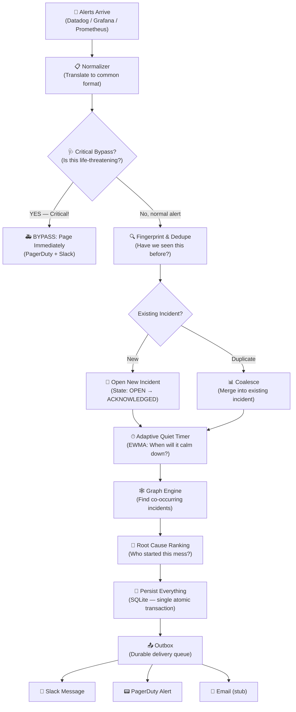

# PulseGraph — System Workflow Explained Simply

## 🏥 The Analogy: A Smart Hospital Emergency Room

Imagine your monitoring tools (Datadog, Grafana, Prometheus) are like **patients walking into an ER**. The problem? During a crisis, 50 patients might show up with the *same* complaint — "my stomach hurts." A dumb ER would page 50 separate doctors. PulseGraph is the **smart triage nurse** that groups, prioritizes, and only calls the right doctor at the right time.

---

## The Workflow (Step by Step)



---

## Explained Like the Hospital ER

### 1. 🚨 Patients Arrive (Alert Ingestion)

Different ambulance services (Datadog, Grafana, Prometheus) bring patients in. Each speaks a different language.

**In code:** Webhooks hit `/v1/ingest/datadog`, `/v1/ingest/grafana`, or `/v1/ingest/prometheus`. Each has its own normalizer that translates the vendor-specific JSON into a common `NormalizedEvent` format — like a universal patient intake form.

> **Analogy:** No matter which ambulance brings you in, the intake nurse fills out the same standard form.

---

### 2. 🩺 Triage — Is This Life-Threatening? (Critical Bypass)

Before anything else, the system checks: **is this a critical alert from a protected service?** (e.g., `payment-gateway` is down, or a database is unreachable).

- **YES →** Skip ALL normal processing. Immediately page PagerDuty AND post to Slack. No grouping, no deduplication, no waiting. Straight to the surgeon.
- **NO →** Continue to normal processing.

> **Analogy:** If someone walks in with a heart attack, you don't put them in the waiting queue. They go straight to the operating room.

---

### 3. 🔍 Registration — Have We Seen You Before? (Fingerprint & Dedupe)

The system generates a **stable fingerprint** from the alert's service, alert name, and labels. Then it checks: does an active incident with this fingerprint already exist?

- **New patient →** Open a new incident (state: OPEN → ACKNOWLEDGED).
- **Repeat visitor →** Coalesce into the existing incident. Increment `alert_count`. Don't open a new case.

> **Analogy:** If 20 people come in saying "the cafeteria food made me sick," the ER doesn't open 20 cases. They open one "food poisoning outbreak" case and add patients to it.

---

### 4. ⏱ Adaptive Quiet Timer (EWMA — "When Will This Calm Down?")

For every incident, the system calculates: **when is the next alert likely to arrive?** Using an Exponential Weighted Moving Average (EWMA) of the gaps between alerts.

- If alerts keep coming every 10 seconds → timer stays active, don't resolve yet.
- If the gap grows (30s… 60s… 2 minutes) → the incident is likely calming down.
- When the timer expires with no new alerts → the incident moves to **QUIESCENT** (quiet).

> **Analogy:** The nurse watches the waiting room. If new patients with the same complaint keep arriving every minute, the outbreak is still active. Once no one new shows up for a while, she marks it "subsiding."

---

### 5. 🕸 Graph Engine — Who Else Is Sick? (Co-occurrence Graph)

When an incident is processed, the system looks at **all other active incidents in the same scope** (same environment/cluster). It builds a directed graph of edges between incidents that overlap in time.

> **Analogy:** The ER notices that patients from the cafeteria have stomach aches, but the kitchen staff also has skin rashes, and the water supply test just flagged contamination. These are all connected.

---

### 6. 🎯 Root Cause Ranking — Who Started This Mess?

The graph engine uses **PageRank-style ranking** on the co-occurrence graph to identify which incident is likely the root cause.

> **Analogy:** Tracing back, the nurse determines: "It all started with the water supply. Fix that, and the food poisoning and rashes will resolve too." This hint is attached to all related incidents.

---

### 7. 💾 The Vault — Atomic Persistence (SQLite)

Everything above happens inside a **single SQLite transaction** (BEGIN IMMEDIATE → COMMIT). This means either everything is saved or nothing is. The raw event is hash-chained (SHA-256) to the previous event, creating a tamper-evident audit log.

What gets written atomically:
- `raw_events` → the alert itself (hash-chained)
- `incidents` → created or updated incident
- `edges` → graph connections
- `outbox` → delivery intents for Slack/PagerDuty

> **Analogy:** The patient chart, the diagnosis, the prescription, and the pharmacy order are all stamped and filed at the exact same moment. Nothing can be lost or tampered with — every page links cryptographically to the previous one.

---

### 8. 📤 The Mailroom — Durable Delivery (Outbox Worker)

A background worker polls the `outbox` table every 500ms. For each pending row:
- **channel = "slack"** → Calls Slack API (`chat.postMessage` or `chat.update`)
- **channel = "pagerduty"** → Calls PagerDuty Events API v2 (`trigger` / `acknowledge` / `resolve`)
- **channel = "email"** → Stub (logged but not sent)

If delivery fails, it retries with **exponential backoff** (2s → 4s → 8s → …) up to 5 attempts. After 5 failures, the row is marked "dead."

> **Analogy:** The mailroom picks up prescriptions and sends them to the pharmacy (Slack), the specialist (PagerDuty), or the patient's home (email). If the pharmacy line is busy, they try again later. After 5 failed attempts, they flag it for manual follow-up.

---

### 9. 🧬 Optional: GitHub Diagnosis (AI-Powered)

If a GitHub App is connected and Ollama (local AI) is running, PulseGraph can:
1. Look up which **GitHub repository** owns the failing service
2. Fetch a **read-only snapshot** of the code (pinned to a specific commit SHA)
3. Ask the local AI model to **diagnose the root cause** from the source code
4. Optionally propose a **code patch**

> **Analogy:** After diagnosing "water contamination," the hospital sends a maintenance team to inspect the plumbing blueprints, find the broken pipe, and suggest a fix — all without ever touching the actual plumbing (read-only).

---

## System Architecture (One Picture)

```
┌─────────────────────────────────────────────────────────────────┐
│                     MONITORING TOOLS                            │
│         Datadog  ·  Grafana  ·  Prometheus                      │
└──────────┬──────────────┬──────────────┬────────────────────────┘
           │              │              │
           ▼              ▼              ▼
┌─────────────────────────────────────────────────────────────────┐
│                    FastAPI Ingest Spine                          │
│  /v1/ingest/datadog  ·  /v1/ingest/grafana  ·  /v1/ingest/prom │
│                                                                 │
│  ┌──────────┐  ┌────────────┐  ┌───────────┐  ┌─────────────┐  │
│  │Normalizer│→ │Critical    │→ │Fingerprint│→ │Incident     │  │
│  │          │  │Bypass Check│  │& Dedupe   │  │State Machine│  │
│  └──────────┘  └────────────┘  └───────────┘  └──────┬──────┘  │
│                                                       │         │
│  ┌──────────────┐  ┌───────────────┐                  │         │
│  │EWMA Adaptive │← │Co-occurrence  │← ───────────────┘         │
│  │Quiet Timer   │  │Graph + Ranker │                            │
│  └──────┬───────┘  └───────────────┘                            │
│         │                                                       │
│         ▼                                                       │
│  ┌─────────────────────────────────────┐                        │
│  │ SQLite (single atomic transaction)  │                        │
│  │ raw_events · incidents · edges ·    │                        │
│  │ outbox · github_* tables            │                        │
│  └──────────────┬──────────────────────┘                        │
│                 │                                                │
│         ┌───────┴───────┐                                       │
│         │ Outbox Worker │ (polls every 500ms)                   │
│         └───┬───────┬───┘                                       │
│             │       │                                            │
└─────────────┼───────┼────────────────────────────────────────────┘
              │       │
              ▼       ▼
         ┌───────┐ ┌──────────┐
         │ Slack │ │PagerDuty │
         └───────┘ └──────────┘
```

---

## Key Design Principles

| Principle | What It Means |
|---|---|
| **Alert Fatigue Buster** | Groups noisy duplicate alerts into single incidents |
| **Transactional Outbox** | Notifications are written in the same DB transaction as data — no lost messages |
| **Hash-Chained Audit** | Every raw event is SHA-256 chained — tamper-evident log |
| **Critical Bypass** | Life-threatening alerts skip ALL processing and page immediately |
| **Adaptive Silence** | EWMA-based timers predict when an incident is calming down |
| **Graph-Based Root Cause** | Co-occurrence graph + PageRank identifies the real source |
| **Read-Only GitHub** | Source code analysis never gets write access to your repos |
| **Local AI Only** | Ollama runs locally — your code never leaves your machine |

---

## TL;DR in One Sentence

> **PulseGraph is a smart ER triage nurse for your alerts** — it groups the noise, pages you only when it matters, identifies the root cause from a web of related incidents, and optionally reads your source code locally to tell you *what broke and where*.
